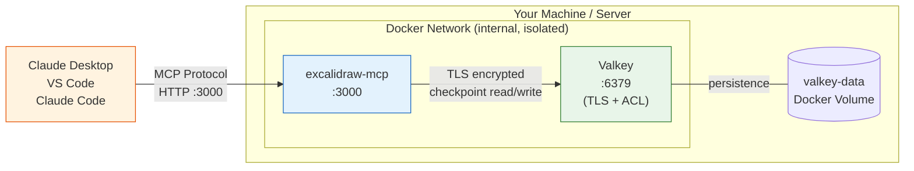
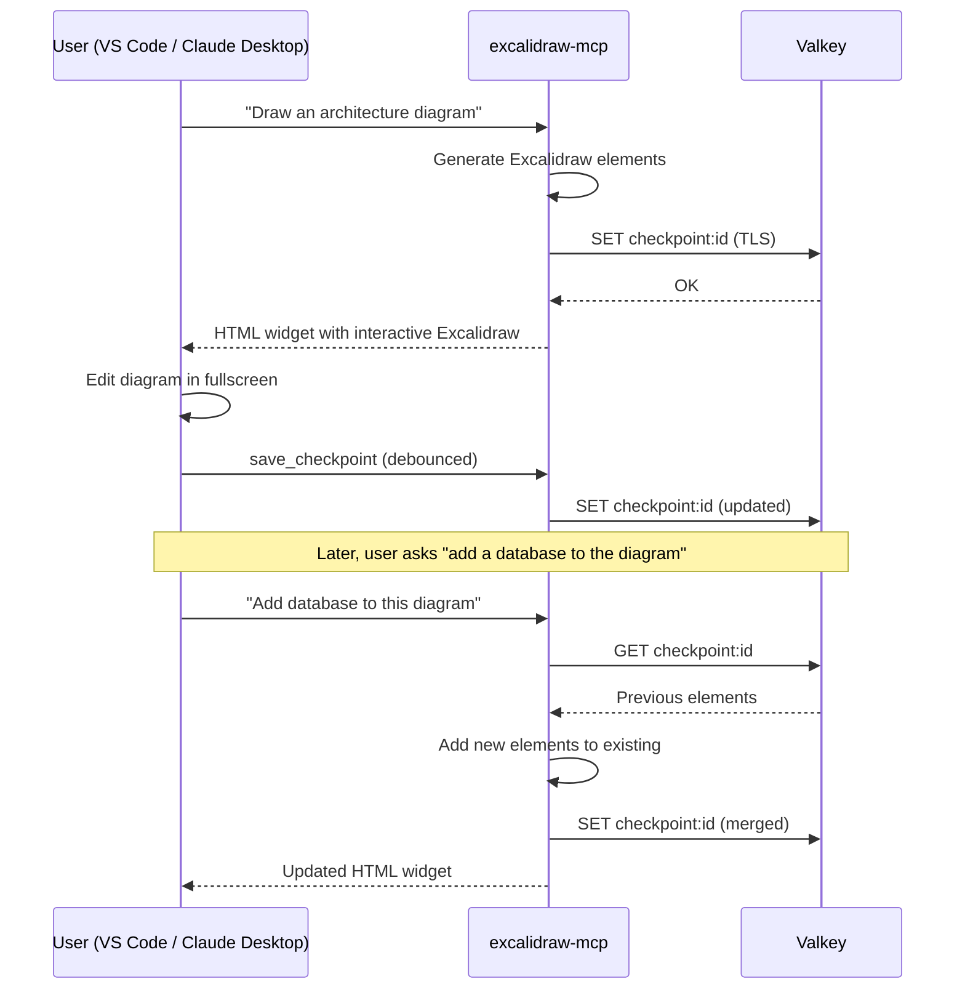

# Excalidraw MCP Docker

Self-hosted Excalidraw MCP server with Valkey persistence.

[](https://github.com/gaiar/excalidraw-mcp-docker/actions/workflows/ci.yml)
[](LICENSE)
[](https://ghcr.io/gaiar/excalidraw-mcp-docker)

## What is this?

A fork of [excalidraw/excalidraw-mcp](https://github.com/excalidraw/excalidraw-mcp) that adds Docker and Valkey for self-hosted and on-premise deployments.

- **Use upstream** if you deploy to Vercel or want the hosted cloud experience.
- **Use this fork** if you need to run everything on your own infrastructure -- on-premise, home lab, or local machine with persistent diagram storage. Note: the Excalidraw widget loads a font from `esm.sh` at runtime, so internet access is still required.

What this fork adds:

- Docker Compose stack (app + Valkey)
- `ValkeyCheckpointStore` replacing Upstash Redis for checkpoint persistence
- Mutual TLS + ACL security between containers
- GitHub Actions CI (quality checks + multi-platform Docker image)
- Multi-platform Docker image published to GHCR

## Architecture



Key points:

- Valkey is **not exposed** to the host network -- only the MCP app container can reach it.
- All traffic between the app and Valkey is TLS-encrypted with mutual certificate authentication.
- Diagram checkpoints are stored in a Docker volume and survive container restarts.

## How MCP Apps Work



The MCP server exposes two tools:

1. **`read_me`** -- returns a cheat sheet with element format, color palettes, and examples. The model calls this before creating diagrams.
2. **`create_view`** -- takes Excalidraw elements as JSON, streams an interactive HTML widget with hand-drawn animations. After final render, a PNG screenshot is sent back as model context so the model can see the result and iterate.

Checkpoints allow the model to **resume and modify** existing diagrams across conversation turns without re-sending the full element array.

## Quick Start

```bash
git clone https://github.com/gaiar/excalidraw-mcp-docker.git
cd excalidraw-mcp-docker
bash docker/setup.sh
```

The setup script will:

1. Generate TLS certificates for Valkey communication
2. Create a `.env` file with a random Valkey password
3. Build the Docker image and start both containers
4. Wait for health checks to pass and print connection info

Once running, the MCP endpoint is available at `http://localhost:3000/mcp`.

## Connect Your Client

| Client                | Configuration                                                                                                   |
| --------------------- | --------------------------------------------------------------------------------------------------------------- |
| **Claude Desktop**    | Add to `claude_desktop_config.json`:<br/>`{"mcpServers": {"excalidraw": {"url": "http://localhost:3000/mcp"}}}` |
| **Claude Code (CLI)** | `claude mcp add excalidraw http://localhost:3000/mcp`                                                           |
| **VS Code**           | Add to MCP extension settings:<br/>`{"mcpServers": {"excalidraw": {"url": "http://localhost:3000/mcp"}}}`       |

## Security

The Docker stack is configured with multiple layers of hardening:

- **Isolated network** -- Valkey runs on an internal Docker network with no host port exposure.
- **Mutual TLS** -- All app-to-Valkey traffic uses TLS with client certificate authentication.
- **ACL restrictions** -- The Valkey user can only access `checkpoint:*` and `cp:*` keys with a limited command set.
- **No-new-privileges** -- Both containers run with `security_opt: no-new-privileges`.
- **Read-only filesystem** -- Both containers mount their root filesystem as read-only.
- **Resource limits** -- Memory and CPU caps prevent runaway processes.
- **Non-root user** -- The app container runs as a dedicated unprivileged user.

For full details, see [SECURITY.md](SECURITY.md).

## Configuration

All configuration is done through environment variables in the `.env` file.

| Variable                        | Description                      | Default             | Required |
| ------------------------------- | -------------------------------- | ------------------- | -------- |
| `PORT`                          | HTTP server port                 | `3000`              | No       |
| `VALKEY_HOST`                   | Valkey hostname                  | `valkey`            | No       |
| `VALKEY_PORT`                   | Valkey port                      | `6379`              | No       |
| `VALKEY_PASSWORD`               | Valkey password                  | --                  | **Yes**  |
| `VALKEY_TLS_ENABLED`            | Enable TLS for Valkey connection | `true`              | No       |
| `VALKEY_TLS_CA_CERT`            | Path to CA certificate           | --                  | No       |
| `VALKEY_TLS_CLIENT_CERT`        | Path to client certificate       | --                  | No       |
| `VALKEY_TLS_CLIENT_KEY`         | Path to client private key       | --                  | No       |
| `VALKEY_DB`                     | Valkey database number           | `0`                 | No       |
| `VALKEY_CHECKPOINT_TTL_SECONDS` | Checkpoint time-to-live          | `2592000` (30 days) | No       |

## Development

### Prerequisites

- Node.js 20+
- pnpm 10+

### Local development

```bash
pnpm install
pnpm run dev        # watch + serve (full MCP flow)
pnpm run dev:ui     # standalone UI with mock app (no server needed)
```

### Quality checks

```bash
pnpm run quality    # typecheck + lint + format + test (all-in-one)
pnpm run typecheck  # TypeScript type checking
pnpm run lint       # ESLint
pnpm run format     # Prettier check
pnpm run test       # Vitest
pnpm run test:coverage  # Vitest with coverage report
```

### Docker build

```bash
pnpm run build:docker   # build multi-platform Docker image
```

## Production Deployment

> Deployment instructions for your specific server will be configured separately.
> See DEPLOYMENT.md (to be created during deployment setup).

## Upstream

This project is a fork of [excalidraw/excalidraw-mcp](https://github.com/excalidraw/excalidraw-mcp).

### Syncing with upstream

```bash
git remote add upstream https://github.com/excalidraw/excalidraw-mcp.git
git fetch upstream
git merge upstream/main
```

### What we changed and why

| Change                              | Why                                                              |
| ----------------------------------- | ---------------------------------------------------------------- |
| Docker Compose stack (app + Valkey) | Self-hosted deployment without cloud dependencies                |
| `ValkeyCheckpointStore` (ioredis)   | Replaces Upstash Redis -- works with any Redis-compatible server |
| Mutual TLS + ACL between containers | Secure inter-service communication out of the box                |
| GitHub Actions CI                   | Automated quality checks and multi-platform Docker image builds  |
| Multi-platform image (GHCR)         | `linux/amd64` and `linux/arm64` support                          |

The upstream Excalidraw MCP app logic, rendering pipeline, and tool definitions are kept intact. All changes are additive -- the fork can still run in standalone mode (without Valkey) using the original in-memory or file-based checkpoint stores.

## License

[MIT](LICENSE)
